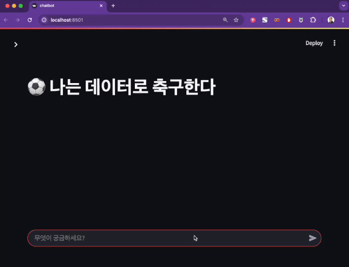

# Streamlit

One way to build LLM apps fast. All in pure Python. No front‑end experience required.



## How to Install

```bash
conda activate facamp-2025-winter
pip install streamlit
```

## How to Run Code

```bash
streamlit run chatbot_template.py
```

## API Reference

https://docs.streamlit.io/develop/api-reference
