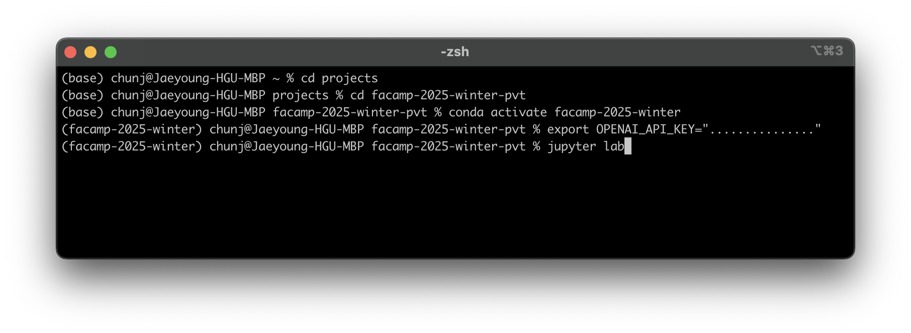

# Setting Up OpenAI API Key

여러가지 방법이 있겠지만, 가장 안전한 방법 중에 하나는 Jupyter Notebook에 직접 입력하지 않는 방법입니다.

미리 Terminal에서 OpenAI API Key를 환경변수로 설정한 후, 그런 다음 Jupyter Lab을 실행하고, Python 코드에서는 이 환경변수를 읽어오는 방식입니다.

이렇게 해야, 혹 코드를 GitHub에 push하거나 다른 사람과 다른 매체를 통해 공유하거나 할 때, API Key가 노출되지 않는 형태로 진행 가능합니다.

물론 공유 전에 지우거나 하면 되지만, 번거럽고, 무엇보다 사람은 까먹고 또 실수를 하기에.. 얼마전에도 같이 프로젝트 진행하는 친구가 API Key를 GitHub에 노출 시키는 바람에 OpenAI에서 강제로 Key를 파괴했다고 이메일이 날라오기도 했습니다. 잘 못 하면 계정이 취소될 수도 있기에 조심하시기 바랍니다.

## Mac

```
export OPENAI_API_KEY="..."
```

## Windows

```
setx OPENAI_API_KEY "..."
```

## Example

다음은 OpenAI API Key를 환경변수로 설정하고, Python 코드에서 읽어오는 방법입니다:



```python
import os

openai_api_key = os.environ.get("OPENAI_API_KEY")
```
